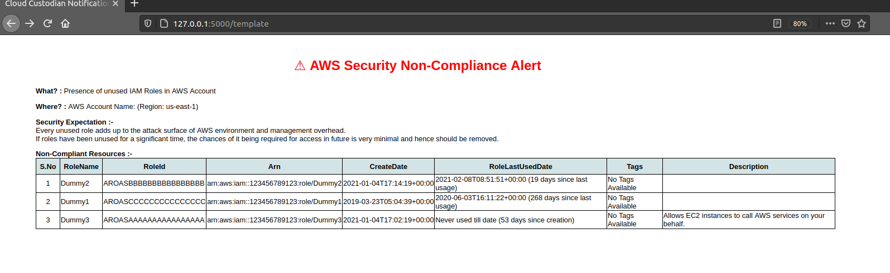
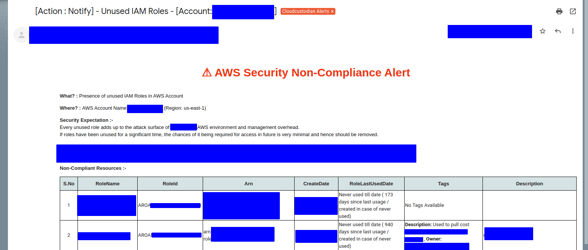

# c7n-mailer Playground

This is a very simple flask based app that helps in creating and testing Jinja templates for [c7n-mailer](https://cloudcustodian.io/docs/tools/c7n-mailer.html).

This was created for helping me write custom mailer templates for my organization's c7n setup.

## 1. Background

I was bored with custodian's default template and I had some use case to add some disclaimers and add some flashy message 
to get the attention of the teams violating certain compliances.

Testing the new template was difficult as I had to keep sending emails to my inbox as test mails to check the rendered
template.

Hence the birth of this simple setup.

It uses flask to serve the API service. It uses jinja (same as what c7n-mailer uses) as 
it's template engine along with same jinja filters that c7n-mailer provides for usage.

## 2. Installation

* Clone this repository 
  ```
  git clone https://github.com/rams3sh/c7n-mailer_playground
  cd c7n-mailer_playground/
  ```

* Install the Virtual Environment Package for Python
  ```
  pip3 install virtualenv
  ``` 
* Create virtualenvironment in the folder
    ```
    python3 -m virtualenv env
    ```
* Activate the virtual environment
    ```
    source env/bin/activate
    ```
* Install the dependencies 
    ```
    pip install -r requirements.txt
    ```

## 3. Running the app
```bash
python3 playground.py
```

There are two endpoints for the app.

* `/webhook` - This is used as an endpoint to get the raw json of cloudcustodian output and save it in the 
  data folder. It supports `POST` method.
  

* `/template?name=<template_name>` - This endpoint is used to check how the rendered output will look like.
It supports `GET` method. One can use custom template name being passed as part of name parameter. 
  By default, it uses test_template.html.j2 as template if no name is passed.
  
## 4. Usage

### 4.1 Getting the raw custodian result json 
Add the below snippet as part of the actions in your policy for which the template is being prepared. 

```
      - type: webhook
        url: http://127.0.0.1:5000/webhook
        method: POST
        body: "@" 
```

Ensure that the actions section also has your `notify` action, since certain sections of the rendered template 
would require it.

The above snippet basically results in your policy hitting this API service endpoint with the json
that c7n-mailer would end up receiving in it's SQS queue otherwise.


Run the c7n_mailer playground in the background and then execute the custodian policy. 
Once the webhook is hit , the posted  result is saved as custodian_result.json in data folder within the same project.

Now you have the base json to work on and create / test jinja template based on it.

**Note:** 

Assumption of the above snippet is that the policy and the playground is being run in your local system.

If there is any change to the above assumption in your setup, then change and use the webhook url in the above snippet accordingly. 

### 4.2 Testing the mailer template

Once the policy's sample result data is collected in data folder. Now we can start creating / testing the template. 

You can access the playground at :-

&nbsp; &nbsp; http://127.0.0.1:5000/template

By default, it renders, `test_template.html.j2`.

You can keep making changes to the template in the side and refresh the site to see the changes getting reflected.


**Note :**
  
If you are using a custom template, you have to place your template in the templates folder. 
You can pass the template name as value to `name` parameter to the same url.


## 5. Sample Screenshot

#### Sample template prepared and rendered via playground 




#### Sample mail alert received through c7n-mailer 



Note: 
  
There are some subtle changes in the above mail's template from provided template. 
Hence, a slight difference. However, majority of the template content is same.

## 6. Disclaimer(s)

* The flask app by default runs in DEBUG mode for testing purposes.


* Currently the playground only caters to c7n-mailer's email template testing.