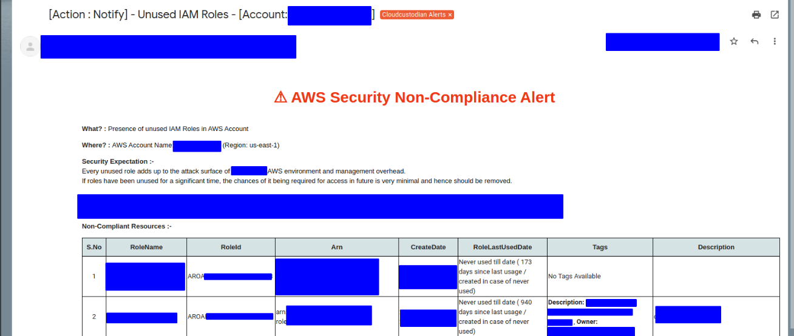

# c7n-mailer template playground

This is a very simple flask based app that helps in creating and testing Jinja templates for c7n-mailer.

This repository also consists of sample mail template created using this playground.

This was created for helping me write custom mailer templates for my organization's c7n setup.

## 1. Background

I was bored with custodian's default template and I had some use case to add some disclaimers and add some flashy message 
to get the attention of the teams violating certain compliances.

Testing the new template was difficult as I had to keep sending emails to my inbox as test mails to check the rendered
template.

Hence the birth of this simple setup.

It uses flask to serve the API service. It uses jinja (same as what c7n-mailer uses) as 
it's template engine along with same jinja filters that c7n-mailer provides for usage.

## 2. Installation

* Install Python3  and PIP package
* Install the Virtual Environment Package for Python
  ```
  pip3 install virtualenv
  ``` 
* Create virtualenvironment in the folder
    ```
    python3 -m virtualenv env
    ```
* Activate the virtual environment
    ```
    source env/bin/activate
    ```
* Install the dependencies 
    ```
    pip install -r requirements.txt
    ```
* Deactivate the environment once done with usage
    ```
    deactivate
    ```
## 3. Running the app
```bash
python3 c7n_mailer_template_tester.py
```

There are two endpoints for the app.

* `/webhook` - This is used as an endpoint to get the raw json of cloudcustodian output and save it in the 
  data folder. It supports `POST` method.
  

* `/template?name=<template_name>` - This endpoint is used to check how the rendered output will look like.
It supports `GET` method. One can use custom template name being passed as part of name parameter. 
  By default, it uses security-non-compliance-mail.html.j2 as template if no name is passed.
  
## 4. Usage

### 4.1 Getting the raw custodian result json 
Add the below snippet as part of the policy for which the template is being prepared. 

```
   actions:
      - type: webhook
        url: http://127.0.0.1:5000/webhook
        method: POST
        batch: true
        body: "@"
```
The above snippet basically results in your policy to hit this API service endpoint with the json
that c7n-mailer would end up receiving in it's SQS queue.

The result is saved as custodian_result.json in data folder within the same project.
This json can be used to prepare and test against our template.


### 4.2 Testing the mailer template

You can access the playground at :-

&nbsp; &nbsp; http://127.0.0.1:5000/template

**Note :**
  
If you are using a custom template, you have to place your template in the templates folder. 
You can pass the template name as value to `name` parameter to the same url.


## 5. Sample Screenshot

#### Playground 


#### Actual Mail

